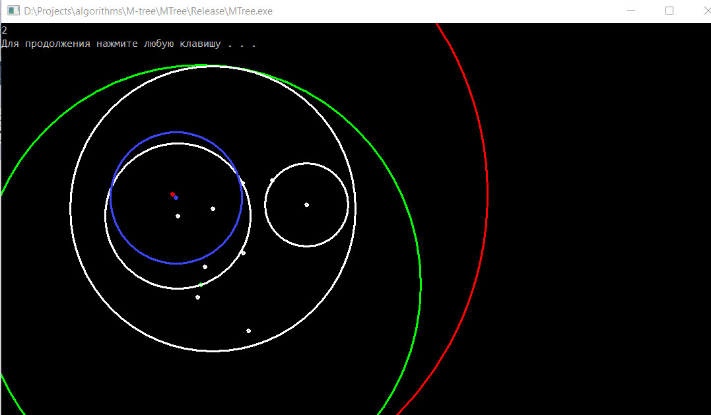
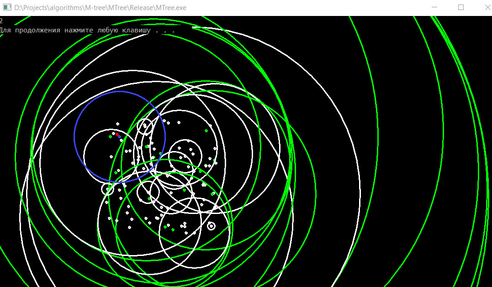
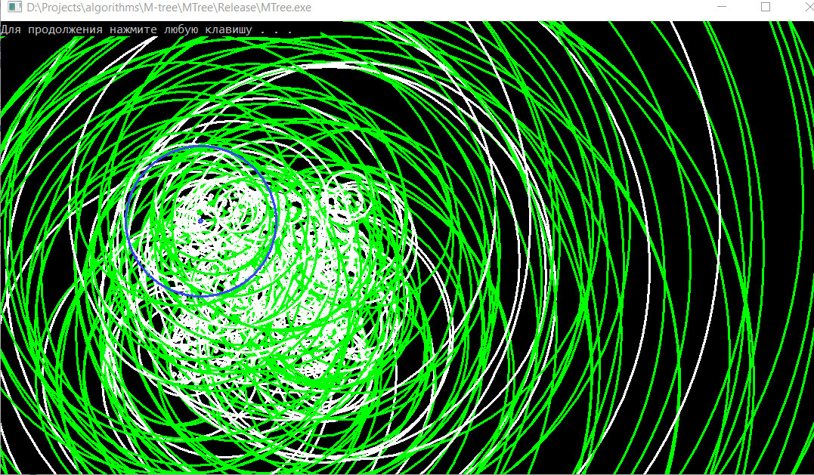

<<<<<<< HEAD
# MM-tasks
=======
# [M-Tree](http://www-db.deis.unibo.it/research/papers/SEBD97.pdf)
Implementaion has a visualisation of M-Tree structure.
====
* 10 points

* 100 points

* 1000 points

>>>>>>> m-tree/master
